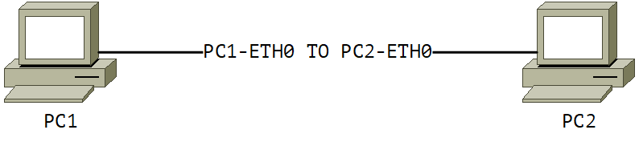

# Соединение хост&ndash;хост

Ввод в ЛВС компьютеров под управлением ОС GNU/Linux при помощи утилит пакета `iproute2`.

## Топология

## Таблица коммутации

| Марка                | Устройство А | Интерфейс А | Устройство Б | Интерфейс Б |
|----------------------|--------------|-------------|--------------|-------------|
| PC1-ETH0 TO PC2-ETH0 | PC1          | eth0        | PC2          | eth0        |

## Таблица адресации

| Устройство | Интерфейс | IP-адрес     | Маска подсети | Шлюз по умолчанию |
|------------|-----------|--------------|---------------|-------------------|
| PC1        | eth0      | 192.168.16.1 | 255.255.255.0 | -                 |
| PC2        | eth0      | 192.168.16.2 | 255.255.255.0 | -                 |

## Задачи

1. Предварительная подготовка лабораторного окружения
2. Настройка устройств компьютерной сети
3. Определение технического состояния компьютерной сети

## Сценарий задания

### Обстановка

Имеется два компьютера под управлением операционной системы семейства GNU/Linux.
Каждый из них оснащён сетевым интерфейсом типа Ethernet.
Компьютеры соединены "напрямую" при помощи коммутационного шнура типа витая пара категории не ниже Cat5e, который обжат разъемами 8P8C по стандарту T568B.

Необходимо обеспечить устойчивую двунаправленную связь между двумя хостами на канальном и сетевом уровнях модели OSI,
используя ручную настройку сетевых параметров с помощью утилит пакета `iproute2`.

### Общие сведения

Для организации связи между двумя сетевыми узлами в одной подсети достаточно:

- физического соединения устройств
- нахождения устройств в одном широковещательном домене
- правильной настройки параметров IP на сетевых интерфейсах (IP-адреса и маски подсети)

В современных Linux-системах управление сетевыми настройками можно осуществлять с помощью утилит пакета `iproute2`:

- `ip link` &ndash; управление состоянием интерфейсов
- `ip address` &ndash; назначение/просмотр IP-адресов
- `ip neigh` &ndash; просмотр и управление таблицей ARP
- `ping` &ndash; проверка доступности

## Инструкции

### Предварительная подготовка лабораторного окружения

### Настройка устройств компьютерной сети

### Определение технического состояния компьютерной сети