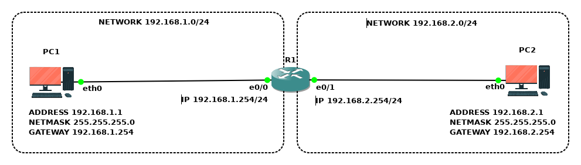

# Объединение сетей маршрутизатором

## Топология

## Коммутация

| Маркировка           | Сторона А | Инт. А       | Сторона  Б | Инт. Б |
|----------------------|-----------|--------------|------------|--------|
| R1-ET0/0 TO PC1-ETH0 | R1        | Ethernet 0/0 | PC1        | eth0   |
| R1-ET0/1 TO PC2-ETH0 | R1        | Ethernet 0/1 | PC2        | eth0   |

## Подсети

| Наименование   | IP-адрес       | Шлюз               | Устройства |
|----------------|----------------|--------------------|------------|
| Подсеть левая  | 192.168.1.1/24 | R1 (192.168.1.254) | PC1; R1    |
| Подсеть правая | 192.168.2.1/24 | R1 (192.168.2.254) | PC2; R1    |

## Адресация

| Устройство | Интерфейс    | IP-адрес      | Маска подсети | Шлюз по умолчанию |
|------------|--------------|---------------|---------------|-------------------|
| PC1        | eth0         | 192.168.1.1   | 255.255.255.0 | 192.168.1.254     |
| PC2        | eth0         | 192.168.2.1   | 255.255.255.0 | 192.168.2.254     |
| R1         | Ethernet 0/0 | 192.168.1.254 | 255.255.255.0 | -                 |
| R1         | Ethernet 0/1 | 192.168.2.254 | 255.255.255.0 | -                 |

## Задачи

1. Предварительная подготовка лабораторного окружения
2. Настройка устройств компьютерной сети
3. Определение технического состояния компьютерной сети

<!-- ## Сценарий задания

### Обстановка

### Общие сведения -->

## Необходимые ресурсы для выполнения задания

- Один компьютер с установленным гипервизором **VMWare Workstation Pro**
- Виртуальная машина **AstraLinuxCN-GNS3**

