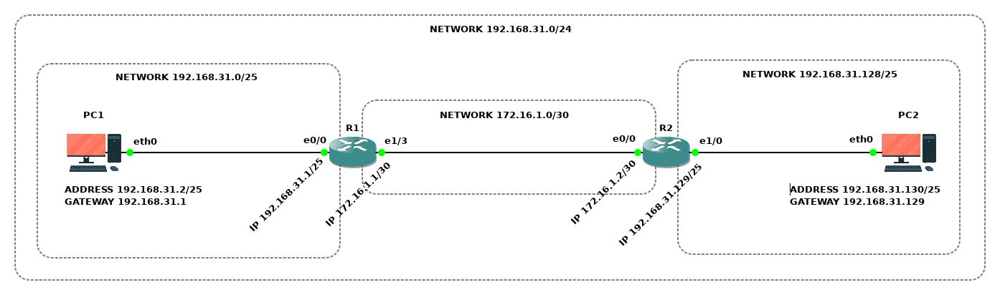

# Статическая маршрутизация

Обеспечить сетевое взаимодействие хоста **PC1** из **Подсети левой** с хостом **PC2** из **Подсети правой**.

## Топология

<!-- ## Коммутация

| Маркировка           | Сторона А | Инт. А       | Сторона  Б | Инт. Б |
|----------------------|-----------|--------------|------------|--------|
| R1-ET0/0 TO PC1-ETH0 | R1        | Ethernet 0/0 | PC1        | eth0   |
| R1-ET0/1 TO PC2-ETH0 | R1        | Ethernet 0/1 | PC2        | eth0   | -->

## Подсети

| Наименование        | IP-адрес          | Шлюз                | Устройства |
|---------------------|-------------------|---------------------|------------|
| Подсеть частная     | 192.168.31.0/24   | -                   | -          |
| Подсеть левая       | 192.168.31.0/25   | R1 (192.168.31.1)   | PC1; R1    |
| Подсеть правая      | 192.168.31.128/25 | R2 (192.168.31.129) | PC2; R2    |
| Подсеть точка-точка | 172.16.1.0/30     | -                   | R1; R2     |

## Адресация

| Устройство | Интерфейс    | IP-адрес         | Маска подсети   | Шлюз по умолчанию |
|------------|--------------|------------------|-----------------|-------------------|
| PC1        | eth0         | 192.168.31.2     | 255.255.255.128 | 192.168.31.1      |
| PC2        | eth0         | 192.168.31.130   | 255.255.255.128 | 192.168.31.129    |
| R1         | Ethernet 0/0 | 192.168.31.1     | 255.255.255.128 | -                 |
| R1         | Ethernet 1/3 | 172.16.1.1       | 255.255.255.248 | -                 |
| R2         | Ethernet 1/0 | 192.168.31.129   | 255.255.255.128 | -                 |
| R2         | Ethernet 0/0 | 172.16.1.2       | 255.255.255.248 | -                 |

<!-- ## Статические маршруты -->

## Задачи

1. Предварительная подготовка лабораторного окружения
2. Настройка устройств компьютерной сети
3. Определение технического состояния компьютерной сети

<!-- ## Сценарий задания

### Обстановка

### Общие сведения -->

## Необходимые ресурсы для выполнения задания

- Один компьютер с установленным гипервизором **VMWare Workstation Pro**
- Виртуальная машина **AstraLinuxCN-GNS3**

