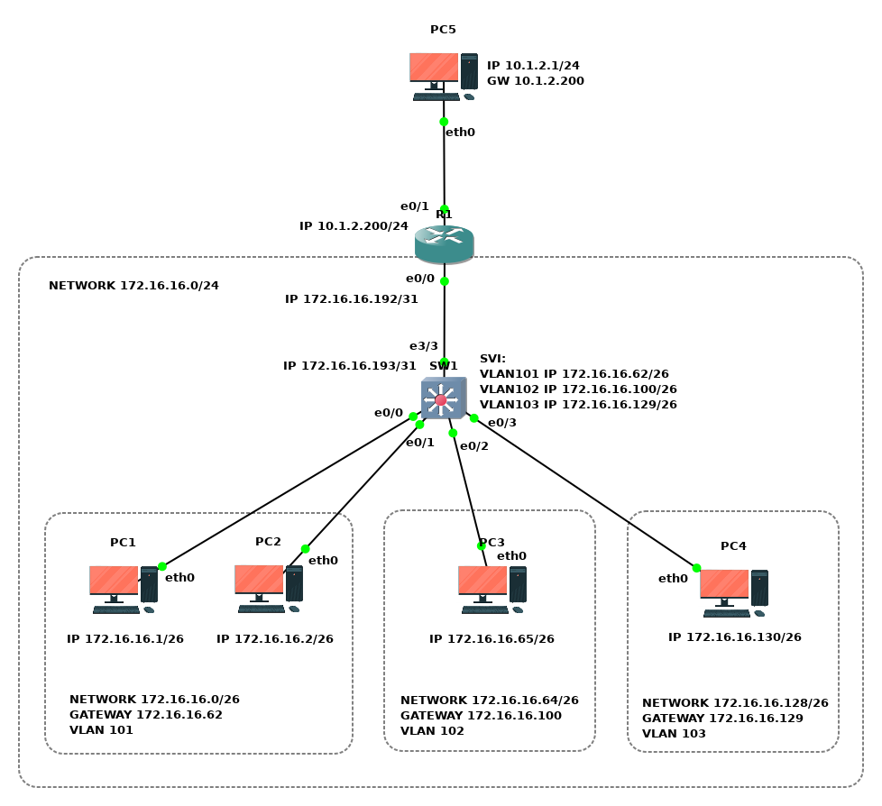

# Маршрутизируемый порт

Обеспечить сетевое взаимодействие хостов (**PC1**, **PC2**, **PC3**, **PC4**) разрешив **маршрутизацию между VLAN** (**inter-VLAN routing**) по технологии **виртуальных коммутируемых интерфейсов** (**SVI &ndash; Switch Virtual Interface**).

## Топология

<!-- ## Коммутация

| Маркировка           | Сторона А | Инт. А       | Сторона  Б | Инт. Б |
|----------------------|-----------|--------------|------------|--------|
| R1-ET0/0 TO PC1-ETH0 | R1        | Ethernet 0/0 | PC1        | eth0   |
| R1-ET0/1 TO PC2-ETH0 | R1        | Ethernet 0/1 | PC2        | eth0   | -->

## VLANs

| VLAN | Наименование | Устройство (access-интерфейсы) |
| :--- | :--- | :--- |
| 101 | Подсеть Юго-запад | SW1 (Ethernet 0/0; Ethernet 0/1) |
| 102 | Подсеть Юг-центр | SW1 (Ethernet 0/2) |
| 103 | Подсеть Юго-восток | SW1 (Ethernet 0/3) |

## Подсети

| Наименование | IP-адрес | Шлюз | Устройства |
|:---|:---|:---|:---|
| **Подсеть Юг** | **172.16.16.0/24** | **-** | **-** |
| ├─ Подсеть Юго-запад | 172.16.16.0/26 | R1 (172.16.16.62) | PC1; PC2; SW1 |
| ├─ Подсеть Юг-центр | 172.16.16.64/26 | SW1 (172.16.16.100) | PC3; SW1 |
| ├─ Подсеть Юго-восток | 172.16.16.128/26 | SW1 (172.16.16.129) | PC4; SW1 |
| └─ **Неиспользуемая подсеть** | **172.16.16.192/26** | **-** | **-** |
| &emsp;&emsp;└─ Подсеть точка-точка | 172.16.16.192/31 | - | R1; SW1 |

## Адресация

| Устройство | Интерфейс | IP-адрес | Маска подсети | Шлюз по умолчанию |
|:---|:---|:---|:---|:---|
| PC1 | eth0 | 172.16.16.1 | 255.255.255.192 | 172.16.16.62 |
| PC2 | eth0 | 172.16.16.2 | 255.255.255.192 | 172.16.16.62 |
| PC3 | eth0 | 172.16.16.65 | 255.255.255.192 | 172.16.16.100 |
| PC4 | eth0 | 172.16.16.130 | 255.255.255.192 | 172.16.16.129 |
| SW1 | Ethernet 3/3 | 172.16.16.193 | 255.255.255.254 | - |
| SW1 | vlan 101 | 172.16.16.62 | 255.255.255.192 | - |
| SW1 | vlan 102 | 172.16.16.100 | 255.255.255.192 | - |
| SW1 | vlan 103 | 172.16.16.129 | 255.255.255.192 | - |
| R1 | Ethernet 0/0 | 172.16.16.192 | 255.255.255.254 | - |

## Задачи

1. Предварительная подготовка лабораторного окружения
2. Определение текущей конфигурации устройств
3. Настройка устройств компьютерной сети
4. Определение технического состояния компьютерной сети

<!-- ## Сценарий задания

### Обстановка

### Общие сведения -->

## Необходимые ресурсы для выполнения задания

- Один компьютер с установленным гипервизором **VMWare Workstation Pro**
- Виртуальная машина **AstraLinuxCN-GNS3**

