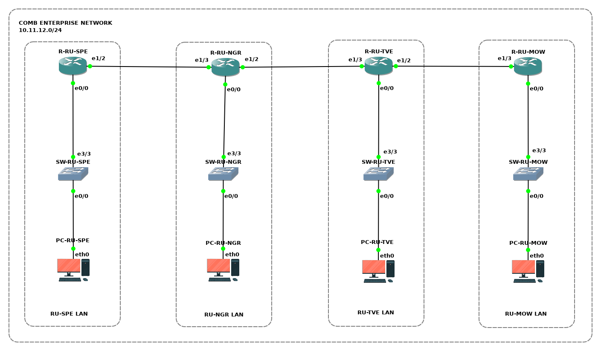

# Администрирование корпоративной сети Comb

Компания *Comb* разворачивает частную корпоративную сеть.
Находясь в роли сетевого инженера, необходимо:
- Спланировать адресное пространство подсетей корпоративной сети компании
- Обеспечить сетевое взаимодействие между рабочими местами подразделений компании применив статическую маршрутизацию

## Исходные данные

Компания *Comb* состоит из 4 подразделений:
- головной офис в Москве (≈100 рабочих мест)
- филиал в Санкт-Петербурге (≈30 рабочих мест)
- филиал в Великом Новогороде (≈25 рабочих мест)
- филиал в Твери (≈20 рабочих мест)

В каждом подразделении компании установлен **граничный маршрутизатор** и **коммутатор доступа**.
При помощи граничных маршрутизаторов осуществляется связь между подразделениями компании по выделенным каналам связи.
Коммутаторы доступа предназначены для организации ЛВС подразделений и подключения рабочих мест пользователей.

Для корпоративной сети *Comb* принято решение использовать частный диапазон IP-адресов из подсети **10.11.12.0/24**.

## Топология

<!-- ## Коммутация

| Маркировка           | Сторона А | Инт. А       | Сторона  Б | Инт. Б |
|----------------------|-----------|--------------|------------|--------|
| R1-ET0/0 TO PC1-ETH0 | R1        | Ethernet 0/0 | PC1        | eth0   |
| R1-ET0/1 TO PC2-ETH0 | R1        | Ethernet 0/1 | PC2        | eth0   | -->

<!-- ## VLANs

| VLAN | Наименование | Устройство (access-интерфейсы) |
| :--- | :--- | :--- |
| 101 | Подсеть Юго-запад | SW1 (Ethernet 0/0; Ethernet 0/1) |
| 102 | Подсеть Юг-центр | SW1 (Ethernet 0/2) |
| 103 | Подсеть Юго-восток | SW1 (Ethernet 0/3) | -->

## Подсети

| Наименование | IP-адрес | Шлюз | Устройства |
|:---|:---|:---|:---|
| **Частная корпоратиная сеть Comb** | **10.11.12.0/24** | **-** | **-** |

<!-- 
## Адресация

| Устройство | Интерфейс | IP-адрес | Маска подсети | Шлюз по умолчанию |
|:---|:---|:---|:---|:---| -->

## Задачи

1. Предварительная подготовка лабораторного окружения
2. Планирование адресного пространства корпоративной сети
3. Настройка устройств корпоративной сети
4. Определение технического состояния корпоративной сети

<!-- ## Сценарий задания

### Обстановка

### Общие сведения -->

## Необходимые ресурсы для выполнения задания

- Один компьютер с установленным гипервизором **VMWare Workstation Pro**
- Виртуальная машина **AstraLinuxCN-GNS3**

