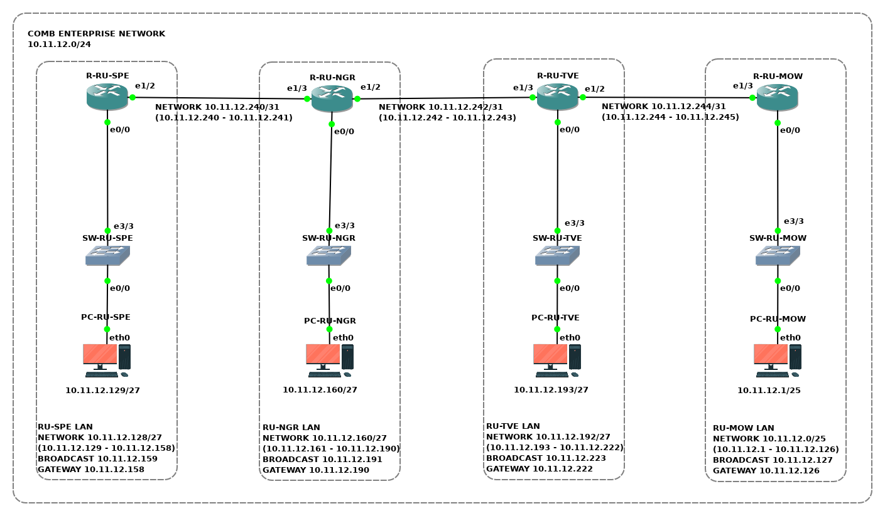

# OSPF для одной области

Компания *Comb* эксплуатирует частную корпоративную сеть.
Для взаимодействия ЛВС филиалов компании на маршрутизаторах **установлены статические маршруты**.
Принято решение перейти к **динамической маршрутизации** с применением протокола **OSPF**.

Находясь в роли сетевого инженера, необходимо перевести частную корпоративную сеть *Comb* на динамическую маршрутизацию с применением протокола OSPF.

## Топология

<!-- TODO:
## Коммутация

| Маркировка           | Сторона А | Инт. А       | Сторона  Б | Инт. Б |
|----------------------|-----------|--------------|------------|--------|
| R1-ET0/0 TO PC1-ETH0 | R1        | Ethernet 0/0 | PC1        | eth0   |
| R1-ET0/1 TO PC2-ETH0 | R1        | Ethernet 0/1 | PC2        | eth0   |
-->

 ## Подсети

| Наименование | IP-адрес | Шлюз | Устройства |
|:---|:---|:---|:---|
| **Частная корпоратиная сеть Comb** | **10.11.12.0/24** | **-** | **-** |
| ├─ Головной офис в Москве | 10.11.12.0/25 | R-RU-MOW (10.11.12.126) | PC-RU-MOW; R-RU-MOW; SW-RU-MOW |
| ├─ Филиал в Санкт-Петербурге | 10.11.12.128/27 | R-RU-SPE (10.11.12.158) | PC-RU-SPE; R-RU-SPE; SW-RU-SPE |
| ├─ Филиал в Великом Новогороде | 10.11.12.160/27 | R-RU-NGR (10.11.12.190) | PC-RU-NGR; R-RU-NGR; SW-RU-NGR |
| ├─ Филиал в Твери | 10.11.12.192/27 | R-RU-TVE (10.11.12.222) | PC-RU-TVE; R-RU-TVE; SW-RU-TVE |
| ├─ **Неиспользуемая подсеть** | **10.11.12.224/28** | **-** | **-** |
| ├─ Транзит R-RU-SPE/R-RU-NGR | 10.11.12.240/31 | - | R-RU-SPE; R-RU-NGR |
| ├─ Транзит R-RU-NGR/R-RU-TVE | 10.11.12.242/31 | - | R-RU-NGR; R-RU-TVE |
| ├─ Транзит R-RU-TVE/R-RU-MOW | 10.11.12.244/31 | - | R-RU-TVE; R-RU-MOW |
| ├─ **Неиспользуемая подсеть** | **10.11.12.246/31** | **-** | **-** |
| └─ **Неиспользуемая подсеть** | **10.11.12.248/29** | **-** | **-** |

<!-- TODO:
## Адресация

| Устройство | Интерфейс | IP-адрес | Маска подсети | Шлюз по умолчанию |
|:---|:---|:---|:---|:---|
-->

## Задачи

1. Предварительная подготовка лабораторного окружения
1. Настройка устройств корпоративной сети
1. Определение технического состояния корпоративной сети

<!-- ## Сценарий задания

### Обстановка

### Общие сведения -->

## Необходимые ресурсы для выполнения задания

- Один компьютер с установленным гипервизором **VMWare Workstation Pro**
- Виртуальная машина **AstraLinuxCN-GNS3**

