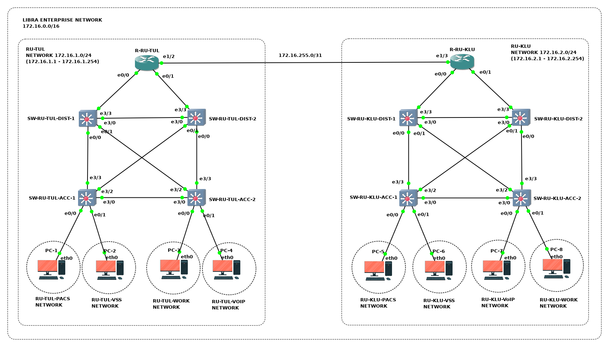

# Администрирование корпоративной сети Либра

Компания *Либра* разворачивает частную корпоративную сеть.
Находясь в роли сетевого инженера, необходимо:
- Спланировать адресное пространство подсетей корпоративной сети компании
- Обеспечить сетевое взаимодействие между хостами подразделений компании применив динамическую маршрутизацию по протоколу OSPF

## Исходные данные

Компания *Либра* состоит из 2 подразделений:
- офис в Туле
- филиал в Калуге

В каждом подразделении компании установлены:
- один **маршрутизатор** для осуществления связи между подразделениями по выделенным каналам связи
- два **L3-коммутатора распределения** для агрегации и маршрутизации трафика
- два **L3-коммутатора доступа** для подключения оконечного оборудования к ЛВС и маршрутизации трафика

## Топология

<!-- ## Коммутация

| Маркировка           | Сторона А | Инт. А       | Сторона  Б | Инт. Б |
|----------------------|-----------|--------------|------------|--------|
| R1-ET0/0 TO PC1-ETH0 | R1        | Ethernet 0/0 | PC1        | eth0   |
| R1-ET0/1 TO PC2-ETH0 | R1        | Ethernet 0/1 | PC2        | eth0   | -->

<!-- ## VLANs

| VLAN | Наименование | Устройство (access-интерфейсы) |
| :--- | :--- | :--- |
| 101 | Подсеть Юго-запад | SW1 (Ethernet 0/0; Ethernet 0/1) |
| 102 | Подсеть Юг-центр | SW1 (Ethernet 0/2) |
| 103 | Подсеть Юго-восток | SW1 (Ethernet 0/3) | -->

<!-- ## Подсети

| Наименование | IP-адрес | Шлюз | Устройства |
|:---|:---|:---|:---|
| **Частная корпоратиная сеть Comb** | **10.11.12.0/24** | **-** | **-** | -->

<!-- 
## Адресация

| Устройство | Интерфейс | IP-адрес | Маска подсети | Шлюз по умолчанию |
|:---|:---|:---|:---|:---| -->

## Задачи

1. Предварительная подготовка лабораторного окружения
2. Планирование адресного пространства корпоративной сети
3. Настройка устройств корпоративной сети
4. Определение технического состояния корпоративной сети

<!-- ## Сценарий задания

### Обстановка

### Общие сведения -->

## Необходимые ресурсы для выполнения задания

- Один компьютер с установленным гипервизором **VMWare Workstation Pro**
- Виртуальная машина **AstraLinuxCN-GNS3**

